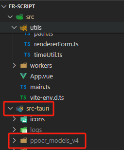
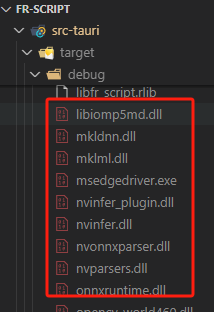

## dll依赖

### dll依赖开发

> 作者没有系统地学过c++，下面两个项目仅供参考，发行版中可以下载最新生成的dll
>

[screenOperation.dll](https://gitee.com/chensuifengran/screen-operation-csfr_dll)

[ppocr.dll（cpu/gpu）](https://gitee.com/chensuifengran/ocr_dll_for_ppocr)

### 本地开发

fr-script v2.0.7全量依赖包

中国移动云盘：

[full_extend_for_2.0.7.7z](https://caiyun.139.com/m/i?145C7XEx6WydU) 提取码：yMAH

1. 把依赖包中的ppocr_models_v4文件夹解压到：项目目录/src-tauri/目录下

2. 把剩余文件和文件夹解压到：项目目录/src-tauri/target/debug/目录下

至此，dll依赖安装完成。
